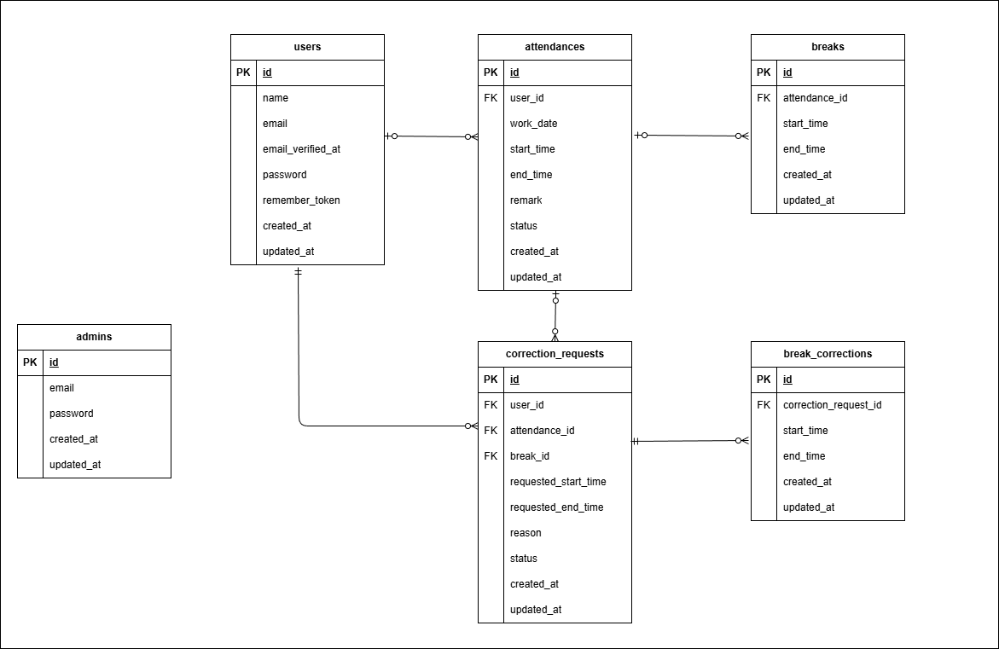

# アプリケーション名
～勤怠管理アプリ（AttendanceManagement）～

## アプリケーション概要
・本アプリは、従業員の勤怠情報を管理するためのWebアプリケーションです。
・一般ユーザーは出勤・退勤・休憩の打刻、および勤怠修正申請を行うことができます。
・管理者は全従業員の勤怠確認、修正申請の承認、CSV出力を行うことができます。

## 主な機能
【一般ユーザー機能】
1.会員登録
2.ログイン / ログアウト
3.出勤打刻
4.退勤打刻
5.休憩開始 / 終了
6.月別勤怠一覧表示
7.勤怠修正申請
8.修正申請一覧表示

【管理者機能】
1.ログイン
2.全体勤怠一覧表示
3.勤怠詳細確認
4.勤怠修正
5.修正申請承認
6.スタッフ一覧表示
7.スタッフ別勤怠一覧表示
8.スタッフ別勤怠CSV出力

## 環境構築
Dockerビルド
・ git clone git@github.com:Zoe0327/AttendanceManagement.git
・ docker-compose up -d --build
*MySQLは、OSによって起動しない場合があるのでそれぞれのPCに併せてdocker-compose.ymlファイルを編集してください。

Laravel環境構築
1. docker-compose exec php bash
2. composer install
3. .env.exampleを.env にリネーム、または新しく.env作成
4. .envに以下の環境変数を追加 --text
    DB_CONNECTION=mysql
    DB_HOST=mysql
    DB_PORT=3306
    DB_DATABASE=laravel_db
    DB_USERNAME=laravel_user
    DB_PASSWORD=laravel_pass
  ※ DB_HOST は docker-compose.yml で定義している MySQL サービス名に合わせて設定してください。
     通常は mysql ですが、環境によってはコンテナ名が異なる場合があります。
5. アプリケーションキーの作成 php artisan key:generate
6. マイグレーションの実行 php artisan migrate
7. シーディングの実行 php artisan db:seed
8. ストレージングの作成 php artisan storage:link

## 使用技術（実行環境）
1.PHP 8.x
2.Laravel 8.x
3.MySQL 8.x
4.Nginx
5.Docker
6.PHPUnit

## 使用技術（外部サービス）
-Mailtrap（メール送信テスト用）

Mailtrap設定（メール認証・通知確認用）
1.https://mailtrap.io/ に会員登録
2.Mailtrapの「Email Testing」からInboxを作成
3.Integrationsより「Laravel 7.x and 8.x」を選択
4.表示されたMAIL設定を .env に貼り付け
例：
MAIL_MAILER=smtp
MAIL_HOST=sandbox.smtp.mailtrap.io
MAIL_PORT=2525
MAIL_USERNAME=xxxx
MAIL_PASSWORD=xxxx
MAIL_ENCRYPTION=tls
MAIL_FROM_ADDRESS=noreply@example.com
MAIL_FROM_NAME="${APP_NAME}"

## CSV出力機能について
-管理者はスタッフ別勤怠一覧画面よりCSV出力が可能です。
-出力項目：勤務日,出勤時間,退勤時間,休憩時間合計,勤務時間合計
-文字コード：UTF-8

## テーブル仕様
-本アプリケーションで使用しているテーブル構成は以下の通りです。

### users テーブル
| カラム名              | 型               | PRIMARY KEY | NOT NULL | UNIQUE | FOREIGN KEY |
| ----------------- | --------------- | ----------- | -------- | ------ | ----------- |
| id                | unsigned bigint | ○           | ○        | -      | -           |
| name              | varchar(255)    | -           | ○        | -      | -           |
| email             | varchar(255)    | -           | ○        | ○      | -           |
| email_verified_at | timestamp       | -           | -        | -      | -           |
| password          | varchar(255)    | -           | ○        | -      | -           |
| remember_token    | varchar(100)    | -           | -        | -      | -           |
| created_at        | timestamp       | -           | -        | -      | -           |
| updated_at        | timestamp       | -           | -        | -      | -           |

### admins テーブル
| カラム名       | 型               | PRIMARY KEY | NOT NULL | UNIQUE | FOREIGN KEY |
| ---------- | --------------- | ----------- | -------- | ------ | ----------- |
| id         | unsigned bigint | ○           | ○        | -      | -           |
| email      | varchar(255)    | -           | ○        | ○      | -           |
| password   | varchar(255)    | -           | ○        | -      | -           |
| created_at | timestamp       | -           | -        | -      | -           |
| updated_at | timestamp       | -           | -        | -      | -           |

### attendances テーブル
| カラム名       | 型               | PRIMARY KEY | NOT NULL | FOREIGN KEY |
| ---------- | --------------- | ----------- | -------- | ----------- |
| id         | unsigned bigint | ○           | ○        | -           |
| user_id    | unsigned bigint | -           | ○        | users(id)   |
| work_date  | date            | -           | ○        | -           |
| start_time | time            | -           | -        | -           |
| end_time   | time            | -           | -        | -           |
| remark     | text            | -           | -        | -           |
| status     | text            | -           | -        | -           |
| created_at | timestamp       | -           | -        | -           |
| updated_at | timestamp       | -           | -        | -           |

### breaks テーブル
| カラム名          | 型               | PRIMARY KEY | NOT NULL | FOREIGN KEY     |
| ------------- | --------------- | ----------- | -------- | --------------- |
| id            | unsigned bigint | ○           | ○        | -               |
| attendance_id | unsigned bigint | -           | ○        | attendances(id) |
| start_time    | time            | -           | ○        | -               |
| end_time      | time            | -           | ○        | -               |
| created_at    | timestamp       | -           | -        | -               |
| updated_at    | timestamp       | -           | -        | -               |

### correction_requests テーブル
| カラム名                 | 型               | PRIMARY KEY | NOT NULL | FOREIGN KEY     |
| -------------------- | --------------- | ----------- | -------- | --------------- |
| id                   | unsigned bigint | ○           | ○        | -               |
| user_id              | unsigned bigint | -           | ○        | users(id)       |
| attendance_id        | unsigned bigint | -           | ○        | attendances(id) |
| break_id             | unsigned bigint | -           | -        | breaks(id)      |
| requested_start_time | time            | -           | ○        | -               |
| requested_end_time   | time            | -           | ○        | -               |
| reason               | text            | -           | ○        | -               |
| status               | tinyint         | -           | ○        | -               |
| created_at           | timestamp       | -           | -        | -               |
| updated_at           | timestamp       | -           | -        | -               |

### break_corrections テーブル
| カラム名                  | 型               | PRIMARY KEY | NOT NULL | FOREIGN KEY             |
| --------------------- | --------------- | ----------- | -------- | ----------------------- |
| id                    | unsigned bigint | ○           | ○        | -                       |
| correction_request_id | unsigned bigint | -           | ○        | correction_requests(id) |
| start_time            | time            | -           | ○        | -                       |
| end_time              | time            | -           | ○        | -                       |
| created_at            | timestamp       | -           | -        | -                       |
| updated_at            | timestamp       | -           | -        | -                       |

## statusカラムの定義
### attendances テーブル status
-勤怠の現在状態を文字列で管理しています。

| 値 | 状態 | 説明 |
|----|------|------|
| working | 勤務中 | 出勤済みで退勤していない状態 |
| finished | 退勤済み | 退勤処理が完了している状態 |

※ 休憩中の判定は breaks テーブルの end_time が null かどうかで判定しています。
※ off_duty / on_break はDBではなく画面表示用ロジックです。

### correction_requests テーブル status
-修正申請の進捗状態を数値で管理しています。

| 値 | 状態 | 説明 |
|----|------|------|
| 0 | 申請中 | 管理者の承認待ち |
| 1 | 承認済み | 管理者が承認済み |

※ 勤怠の表示状態（勤務前・休憩中など）はDBのstatus値ではなく、
attendanceとbreakの状態を組み合わせて動的に判定しています。

## ER図

## テストアカウント
※ 一般ユーザーはSeederによりランダム生成されます。(password: password123に固定）
※ 管理者アカウントは以下の固定値です。
    email: admin@example.com
    password: password123

## PHPUnitを利用したテストに関して
### テスト用データベース作成
docker-compose exec mysql bash
mysql -u root -p

# パスワードは root
create database demo_test;
GRANT ALL PRIVILEGES ON demo_test.* TO 'laravel_user'@'%';
FLUSH PRIVILEGES;

### テスト実行
docker-compose exec php bash
php artisan migrate:fresh --env=testing
./vendor/bin/phpunit